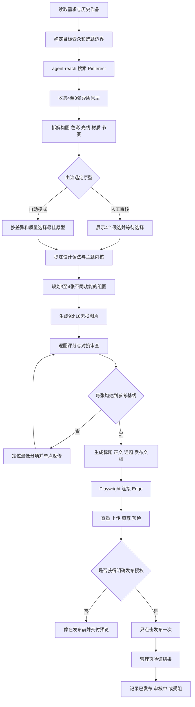

# 小红书图文全自动选题发布

这是一个不限主题的小红书图文创作与发布技能。它使用 `agent-reach` 搜索 Pinterest 原型，把选题参考、视觉拆解、图片生成、质量审查、标题正文话题创作和 Playwright 自动发布串成一套可复用流程。

选题可以来自艺术、生活、旅行、知识、产品、时尚、自然、科幻等合法方向，不预设固定垂类，也可以由用户指定具体主题。参考图只用于拆解构图、色彩、材质、光线和视觉节奏，不复制具体作品。

## 核心能力

- 使用 `agent-reach` 从 Pinterest 只读搜索并收集4至8张候选原型图、预览和来源链接。
- 对候选图进行差异化筛选，避免同质化参考导致系列只会“换场景、换颜色”。
- 从参考图提炼设计语法和思想内核，再形成原创主题、世界观和组图叙事。
- 默认生成3至4张9:16高质量PNG，每张承担不同构图和叙事功能。
- 使用同一套100分量表对参考图和每张成图评分，未达到基线就定向返修并重新评审。
- 自动生成不超过20字的标题、简短正文、相关话题和组图顺序文档。
- 使用 Playwright 操控 Microsoft Edge，完成查重、上传、填充、预检、单次提交和管理页验证。
- 发布遇到登录失效、验证码、风控或状态不明时立即停止，不绕过验证、不重复提交。

## 完整流程图



## 一、准备条件

### 1. 原型搜索能力

需要安装并可调用 `agent-reach`。开始搜索前先检查可用后端：

```powershell
agent-reach doctor --json
```

Pinterest 原型默认通过 `agent-reach` 的 Exa 搜索通道获取，例如：

```powershell
mcporter call 'exa.web_search_exa(query: "site:pinterest.com editorial still life composition muted color", numResults: 8)'
```

查询词应由“主题关键词＋媒介＋构图＋色彩或情绪”组成。一次搜索不应只换同义词，而应主动覆盖不同视觉方向。

示例：

- 纪实摄影＋低机位＋阴天冷灰；
- 拼贴插画＋非对称构图＋高饱和互补色；
- 静物摄影＋俯视网格＋柔和自然光；
- 极简海报＋大面积留白＋单一视觉焦点。

只读采集候选图的预览、页面链接和可观察特征，不绕过 Pinterest 权限，不批量下载受保护原图。Pinterest 无法访问时应如实说明；未经用户同意，不用无关来源冒充 Pinterest 结果。

### 2. 图片生成能力

需要能够生成或编辑图片的工具。最终图片默认为：

- 3至4张；
- 9:16竖图；
- PNG无损格式；
- 每张构图和叙事功能不同；
- 不通过像素放大冒充细节质量。

### 3. 自动发布能力

需要安装 Node.js、Playwright 和 Microsoft Edge。Edge 使用任务专用的持久化用户目录，并开启远程调试端口。首次登录、验证码、风控和实名验证由账号持有者本人完成。

## 二、原型搜索与候选收集

### 第一步：读取需求和历史记录

明确以下信息：

- 内容目标和目标受众；
- 允许与禁止的主题；
- 图片数量、比例和交付格式；
- 是否先给候选供人工审核；
- 近期作品使用过的主题、媒介、主色、构图、光线、焦点和情绪。

历史检查用于避免连续作品第一眼相似。即使文案主题不同，只要构图、色彩和视觉焦点高度雷同，也应视为重复。

### 第二步：用 `agent-reach` 搜索 Pinterest

至少执行两组明显不同的查询，每组返回4至8个结果。搜索结果必须保留：

- Pinterest 页面链接；
- 可查看的预览；
- 图片主题和媒介；
- 构图骨架和视觉焦点；
- 主色、辅色与光线关系；
- 材质、留白、节奏和工艺感；
- 值得借鉴的设计语法；
- 可能导致廉价感或同质化的风险。

### 第三步：筛选4个异质候选

候选之间至少应在媒介、构图、色彩和情绪中的三个方面有明显差异。不要用四张相似图片伪装成四个方向。

每个候选输出：

1. 主题名；
2. 核心命题；
3. 目标受众；
4. 参考图预览与链接；
5. 构图、色彩、光线和材质拆解；
6. 3至4张组图的初步分镜；
7. 与历史作品的差异；
8. 创作风险。

如果用户要求先审核，到这里停止，等待用户选定参考图。

## 三、参考图选择与质量基线

用户选定参考图后，或在自动模式下选择综合价值最高的参考图，然后建立100分质量基线：

| 维度 | 分值 |
|---|---:|
| 构图与视觉层级 | 20 |
| 媒介和材质可信度 | 15 |
| 色彩与光线 | 15 |
| 细节与工艺完成度 | 15 |
| 原创性与主题深度 | 15 |
| 物理和空间逻辑及无瑕疵程度 | 10 |
| 手机缩略图辨识度 | 5 |
| 情绪与叙事张力 | 5 |

评分必须附带可观察证据。参考分一旦固定，不得为了让生成图通过而降低。

## 四、主题深化与组图规划

主题深化不是复制参考图，而是把参考图拆成可迁移的设计语法：

- 构图：中心、对角线、框景、网格、留白或多层空间；
- 色彩：主色、辅色、对比方式和饱和度控制；
- 光线：光源方向、软硬程度、明暗比例和空气感；
- 材质：纸张、玻璃、织物、金属、皮肤、自然介质等可信表现；
- 节奏：焦点密度、重复元素、视觉停顿和阅读顺序；
- 内核：作品真正表达的情绪、观点或叙事冲突。

随后规划3至4张图的不同职责。例如：

1. 首图负责缩略图识别和主题建立；
2. 第二张扩展空间或提供反向视角；
3. 第三张呈现细节、转折或冲突；
4. 第四张负责收束、留白或余韵。

系列必须统一，但不能只是替换场景、颜色、人物或装饰。

## 五、图片生成与强制评审循环

生成完成后，每张图都使用参考图的同一量表评分。

硬性通过条件：

- 每张总分大于等于参考图总分；
- 构图、材质、色光、细节、原创性五项均不低于参考图对应分数；
- 单张独立通过，不能用系列平均分掩盖低分图片。

未通过时执行定向返修：

```text
找出最低分项 → 指明缺陷位置 → 只修改相关提示或局部结构 → 重新生成该图 → 再次评分
```

不得通过锐化、滤镜、简单放大、虚高评分或降低参考分伪造达标。工具能力客观不足时，必须把状态标记为“未达标”，不能把候选图包装成完成稿。

## 六、系列级对抗审查

全部单图通过后，再检查整组作品：

- 构图是否重复；
- 主题是否真正统一；
- 是否具有自己的创作深化；
- 材质、透视和空间逻辑是否可信；
- 是否存在断裂、重复纹理、异常边缘、错误文字和生成伪影；
- 手机缩略图是否能快速识别；
- 是否出现廉价装饰、过度特效和套路化表达；
- 标题正文是否空泛、故作深沉或具有明显机器腔。

对抗审查用于改进本轮未锁定作品和后续创作，不自动修改用户已经审核通过的旧作品。

## 七、标题、正文、话题和交付文档

最终发布素材包括：

- 不超过20字的标题；
- 简短正文，包含具体意象和真实观点；
- 与作品准确匹配的话题；
- 3至4张原始PNG；
- `主题名_年-月-日.md`。

简洁发布文档只包含标题、正文、话题和组图顺序。评分、返修记录和内部审查写入单独质量记录，避免发布文档过于复杂。

## 八、Playwright 自动准备与发布

### 1. 配置文件

复制 [示例配置](examples/post.example.json)，填写标题、正文、话题、图片绝对路径、日志目录和 Edge 调试地址。

### 2. 检查依赖

```powershell
node scripts/publish_xhs_edge.js --check-deps
```

### 3. 只准备，不提交

```powershell
node scripts/publish_xhs_edge.js --config C:\路径\post.json --prepare
```

准备阶段会：

1. 连接已登录的 Edge；
2. 打开笔记管理页检查同标题内容；
3. 上传3至4张最终PNG；
4. 填写标题、正文和话题；
5. 检查图片数量、正文完整性、公开可见状态和页面错误；
6. 保存发布前截图；
7. 停止在发布按钮之前。

### 4. 获得明确授权后发布

```powershell
node scripts/publish_xhs_edge.js --config C:\路径\post.json --publish
```

发布阶段只点击一次，然后用以下证据验证：

- 页面明确显示发布或提交成功；
- 地址包含 `published=true`；
- 笔记管理页出现精确标题和正确首图；
- 获得有效作品编号或链接。

如果管理页显示“审核中”，正确表述是“已提交，审核中”，不能声称已经公开可见。详细技术说明见 [Edge发布规程](references/edge-publishing.md)。

## 九、目录结构

```text
.
├── SKILL.md                         技能入口
├── agents/openai.yaml               界面元数据
├── references/quality-rubric.md     质量评分规则
├── references/edge-publishing.md    发布规程
├── scripts/publish_xhs_edge.js      发布脚本
├── examples/post.example.json       配置示例
├── README.md                        中文说明
└── LICENSE                          开源许可证
```

## 十、安装与调用

将仓库克隆到所使用工具的个人技能目录，并确保文件夹名称为 `xhs-auto-topic-publisher`：

```powershell
git clone https://github.com/wangshen310-hub/xiaohongshu-auto-topic-publisher.git <个人技能目录>\xhs-auto-topic-publisher
```

调用示例：

```text
使用 $xhs-auto-topic-publisher 搜索 Pinterest 并给我4个差异明显的候选方向，先不要生成图片。
```

```text
使用 $xhs-auto-topic-publisher 基于我选定的参考图完成3至4张图片、标题、正文和话题，并执行质量循环。
```

```text
使用 $xhs-auto-topic-publisher 把已审核成稿准备到 Edge 发布页，但不要提交。
```

```text
使用 $xhs-auto-topic-publisher 发布这套已审核成稿，并验证管理页状态。
```

## 十一、安全与使用边界

- 不提供验证码、风控、登录或实名验证绕过功能。
- 不保存或提交Cookie、Token、密码、Edge用户目录和个人发布日志。
- 默认不抓取小红书账号、笔记和互动数据，不伪造流量趋势。
- 参考图只用于分析设计语言，不应直接复制、重新发布或冒充原创摄影。
- `--publish` 会产生真实外部写入，必须获得账号持有者明确授权。
- 页面结构变化时先运行 `--prepare` 并检查截图，不使用盲点坐标反复提交。

## 许可证

[MIT许可证](LICENSE)
